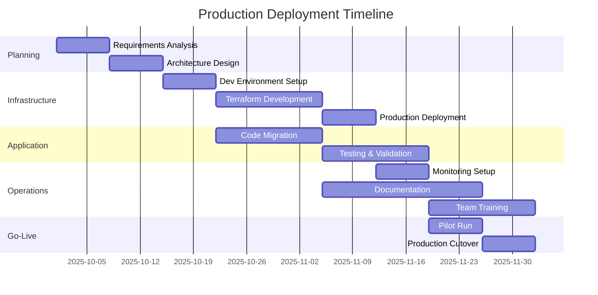

# Production Deployment Guide: Data Pipeline on AWS EC2

## 🎯 Executive Summary

This guide provides a comprehensive, production-ready deployment strategy for the Airflow + dbt + S3-Redshift Sync Tool data pipeline on AWS EC2. It covers infrastructure design, deployment procedures, security best practices, and operational guidelines for maintaining a robust data pipeline in production.

**Key Benefits:**
- Clear separation between development and production environments
- Automated deployment with rollback capabilities
- Enterprise-grade security and monitoring
- Cost-effective scaling strategy
- Proven architecture based on POC success

---

## 📐 Architecture Overview

### System Architecture

```
┌─────────────────────────────────────────────────────────────────────┐
│                          PRODUCTION ENVIRONMENT                      │
├─────────────────────────────────────────────────────────────────────┤
│                                                                     │
│  ┌─────────────────┐    ┌─────────────────┐    ┌──────────────┐  │
│  │  Load Balancer  │───▶│ Airflow Server  │    │  RDS MySQL   │  │
│  │      (ALB)      │    │   (t3.large)    │───▶│  (Metadata)  │  │
│  └─────────────────┘    └─────────────────┘    └──────────────┘  │
│           │                      │                                  │
│           │              ┌───────┴────────┐                       │
│           │              ▼                ▼                       │
│  ┌────────┴────────┬──────────────┬──────────────┐              │
│  │  Worker Node 1  │ Worker Node 2│ Worker Node N│              │
│  │  (t3.medium)    │ (t3.medium)  │ (Auto-scale) │              │
│  │  - Sync Tool    │ - Sync Tool  │ - Sync Tool  │              │
│  │  - Airflow Work │ - Airflow W. │ - Airflow W. │              │
│  └─────────────────┴──────────────┴──────────────┘              │
│           │                │                │                     │
│           └────────────────┼────────────────┘                     │
│                           ▼                                       │
│  ┌──────────────────────────────────────────────────────┐       │
│  │           Shared Resources                            │       │
│  │  - S3 Buckets (Data Lake)                           │       │
│  │  - Redshift Cluster                                 │       │
│  │  - CloudWatch Logs                                  │       │
│  │  - Secrets Manager                                  │       │
│  └──────────────────────────────────────────────────────┘       │
└─────────────────────────────────────────────────────────────────────┘

┌─────────────────────────────────────────────────────────────────────┐
│                        DEVELOPMENT ENVIRONMENT                       │
├─────────────────────────────────────────────────────────────────────┤
│  ┌─────────────────────────────────────────────────┐              │
│  │        All-in-One Development Server             │              │
│  │             EC2 (t3.medium)                      │              │
│  │  - Airflow (all components)                     │              │
│  │  - Sync Tool                                    │              │
│  │  - dbt                                          │              │
│  │  - Development tools                            │              │
│  └─────────────────────────────────────────────────┘              │
└─────────────────────────────────────────────────────────────────────┘
```

### Network Architecture

```yaml
VPC Configuration:
  CIDR: 10.0.0.0/16
  
  Public Subnets:
    - 10.0.1.0/24 (AZ-1) - Load Balancer, NAT Gateway
    - 10.0.2.0/24 (AZ-2) - Load Balancer, NAT Gateway
    
  Private Subnets:
    - 10.0.10.0/24 (AZ-1) - Airflow Server, Workers
    - 10.0.20.0/24 (AZ-2) - RDS Multi-AZ
    
  Database Subnets:
    - 10.0.30.0/24 (AZ-1) - RDS Primary
    - 10.0.40.0/24 (AZ-2) - RDS Standby
```

---

## 🚀 Deployment Pipeline

### Phase 1: Infrastructure Setup

#### 1.1 Prerequisites

```bash
# Required tools
- AWS CLI v2
- Terraform >= 1.0
- Git
- SSH client
- Python 3.10+

# AWS Permissions needed
- EC2: Full access
- RDS: Full access
- S3: Full access
- IAM: Create roles and policies
- VPC: Full access
- Secrets Manager: Full access
- CloudWatch: Full access
```

#### 1.2 Terraform Infrastructure

Create the following Terraform configuration:

```hcl
# terraform/main.tf
terraform {
  required_version = ">= 1.0"
  
  backend "s3" {
    bucket = "company-terraform-state"
    key    = "data-pipeline/terraform.tfstate"
    region = "us-west-2"
  }
}

provider "aws" {
  region = var.aws_region
}

# VPC Module
module "vpc" {
  source = "terraform-aws-modules/vpc/aws"
  version = "5.0.0"
  
  name = "data-pipeline-vpc"
  cidr = "10.0.0.0/16"
  
  azs             = ["us-west-2a", "us-west-2b"]
  private_subnets = ["10.0.10.0/24", "10.0.20.0/24"]
  public_subnets  = ["10.0.1.0/24", "10.0.2.0/24"]
  database_subnets = ["10.0.30.0/24", "10.0.40.0/24"]
  
  enable_nat_gateway = true
  enable_vpn_gateway = false
  enable_dns_hostnames = true
  
  tags = {
    Environment = var.environment
    Project     = "DataPipeline"
  }
}

# Security Groups
resource "aws_security_group" "airflow" {
  name_prefix = "${var.environment}-airflow-"
  vpc_id      = module.vpc.vpc_id
  
  ingress {
    from_port   = 8080
    to_port     = 8080
    protocol    = "tcp"
    security_groups = [aws_security_group.alb.id]
  }
  
  ingress {
    from_port   = 22
    to_port     = 22
    protocol    = "tcp"
    cidr_blocks = var.admin_ip_whitelist
  }
  
  egress {
    from_port   = 0
    to_port     = 0
    protocol    = "-1"
    cidr_blocks = ["0.0.0.0/0"]
  }
  
  tags = {
    Name = "${var.environment}-airflow-sg"
  }
}

# Launch Template for Airflow Server
resource "aws_launch_template" "airflow_server" {
  name_prefix   = "${var.environment}-airflow-server-"
  image_id      = data.aws_ami.ubuntu.id
  instance_type = var.airflow_instance_type
  key_name      = var.key_pair_name
  
  vpc_security_group_ids = [aws_security_group.airflow.id]
  
  iam_instance_profile {
    arn = aws_iam_instance_profile.airflow.arn
  }
  
  block_device_mappings {
    device_name = "/dev/sda1"
    
    ebs {
      volume_size = 100
      volume_type = "gp3"
      encrypted   = true
    }
  }
  
  user_data = base64encode(templatefile("${path.module}/userdata/airflow_server.sh", {
    environment = var.environment
    rds_endpoint = aws_db_instance.airflow_metadata.endpoint
    s3_bucket = aws_s3_bucket.airflow_logs.id
  }))
  
  tag_specifications {
    resource_type = "instance"
    tags = {
      Name = "${var.environment}-airflow-server"
      Role = "airflow-server"
    }
  }
}

# Auto Scaling Group for Workers
resource "aws_autoscaling_group" "workers" {
  name_prefix         = "${var.environment}-sync-workers-"
  vpc_zone_identifier = module.vpc.private_subnets
  
  min_size         = var.worker_min_size
  max_size         = var.worker_max_size
  desired_capacity = var.worker_desired_size
  
  health_check_type         = "ELB"
  health_check_grace_period = 300
  
  launch_template {
    id      = aws_launch_template.worker.id
    version = "$Latest"
  }
  
  tag {
    key                 = "Name"
    value               = "${var.environment}-sync-worker"
    propagate_at_launch = true
  }
}

# RDS for Airflow Metadata
resource "aws_db_instance" "airflow_metadata" {
  identifier     = "${var.environment}-airflow-metadata"
  engine         = "mysql"
  engine_version = "8.0"
  instance_class = var.rds_instance_type
  
  allocated_storage     = 20
  max_allocated_storage = 100
  storage_encrypted     = true
  
  db_name  = "airflow"
  username = "airflow_admin"
  password = random_password.rds_password.result
  
  vpc_security_group_ids = [aws_security_group.rds.id]
  db_subnet_group_name   = aws_db_subnet_group.airflow.name
  
  backup_retention_period = 7
  backup_window          = "03:00-04:00"
  maintenance_window     = "sun:04:00-sun:05:00"
  
  multi_az               = var.environment == "production" ? true : false
  deletion_protection    = var.environment == "production" ? true : false
  
  tags = {
    Name = "${var.environment}-airflow-metadata"
  }
}

# Application Load Balancer
resource "aws_lb" "airflow" {
  name               = "${var.environment}-airflow-alb"
  internal           = false
  load_balancer_type = "application"
  security_groups    = [aws_security_group.alb.id]
  subnets            = module.vpc.public_subnets
  
  tags = {
    Name = "${var.environment}-airflow-alb"
  }
}

# S3 Buckets
resource "aws_s3_bucket" "airflow_logs" {
  bucket = "${var.company_prefix}-${var.environment}-airflow-logs"
  
  tags = {
    Name = "${var.environment}-airflow-logs"
  }
}

resource "aws_s3_bucket_versioning" "airflow_logs" {
  bucket = aws_s3_bucket.airflow_logs.id
  
  versioning_configuration {
    status = "Enabled"
  }
}
```

#### 1.3 Variables Configuration

```hcl
# terraform/variables.tf
variable "aws_region" {
  default = "us-west-2"
}

variable "environment" {
  description = "Environment name (development/staging/production)"
  type        = string
}

variable "airflow_instance_type" {
  description = "EC2 instance type for Airflow server"
  default     = {
    development = "t3.medium"
    staging     = "t3.large"
    production  = "t3.large"
  }
}

variable "worker_min_size" {
  default = {
    development = 1
    staging     = 2
    production  = 2
  }
}

variable "worker_max_size" {
  default = {
    development = 2
    staging     = 4
    production  = 10
  }
}

variable "admin_ip_whitelist" {
  description = "IP addresses allowed SSH access"
  type        = list(string)
  default     = ["YOUR_OFFICE_IP/32"]
}
```

### Phase 2: Application Deployment

#### 2.1 Initial Server Setup Script

```bash
#!/bin/bash
# scripts/setup_server.sh

set -e

# Color codes for output
RED='\033[0;31m'
GREEN='\033[0;32m'
YELLOW='\033[1;33m'
NC='\033[0m'

echo -e "${GREEN}Starting server setup...${NC}"

# Update system
sudo apt update && sudo apt upgrade -y
sudo apt install -y \
    python3.10 python3-pip python3-venv \
    git nginx postgresql-client \
    supervisor htop iotop \
    awscli jq

# Create application user
if ! id -u airflow > /dev/null 2>&1; then
    sudo useradd -m -s /bin/bash airflow
    sudo usermod -aG sudo airflow
fi

# Create directory structure
sudo mkdir -p /opt/{airflow,sync-tool,dbt}/{config,logs}
sudo mkdir -p /opt/airflow/{dags,plugins}
sudo chown -R airflow:airflow /opt/{airflow,sync-tool,dbt}

# Install Python applications
sudo -u airflow bash << 'EOF'
# Airflow installation
cd /opt/airflow
python3 -m venv venv
source venv/bin/activate

pip install --upgrade pip
pip install "apache-airflow[postgres,amazon,celery]==2.8.1" \
    "apache-airflow-providers-amazon>=8.0.0" \
    "dbt-redshift==1.7.0" \
    "boto3>=1.26.0" \
    "redis>=4.5.0"

# Sync tool installation
cd /opt/sync-tool
git clone https://github.com/qiuni-cdc/s3-redshift-backup-tool.git .
source /opt/airflow/venv/bin/activate
pip install -r requirements.txt

# Create symbolic links for CLIs
sudo ln -sf /opt/airflow/venv/bin/airflow /usr/local/bin/airflow
sudo ln -sf /opt/sync-tool/sync_tool.py /usr/local/bin/sync-tool
EOF

# Configure systemd services
sudo tee /etc/systemd/system/airflow-webserver.service << EOF
[Unit]
Description=Airflow Webserver
After=network.target

[Service]
Type=simple
User=airflow
Group=airflow
Environment="PATH=/opt/airflow/venv/bin:/usr/local/bin:/usr/bin"
Environment="AIRFLOW_HOME=/opt/airflow"
ExecStart=/opt/airflow/venv/bin/airflow webserver
Restart=always
RestartSec=10

[Install]
WantedBy=multi-user.target
EOF

sudo tee /etc/systemd/system/airflow-scheduler.service << EOF
[Unit]
Description=Airflow Scheduler
After=network.target

[Service]
Type=simple
User=airflow
Group=airflow
Environment="PATH=/opt/airflow/venv/bin:/usr/local/bin:/usr/bin"
Environment="AIRFLOW_HOME=/opt/airflow"
ExecStart=/opt/airflow/venv/bin/airflow scheduler
Restart=always
RestartSec=10

[Install]
WantedBy=multi-user.target
EOF

# Enable and start services
sudo systemctl daemon-reload
sudo systemctl enable airflow-webserver airflow-scheduler
sudo systemctl start airflow-webserver airflow-scheduler

echo -e "${GREEN}Server setup complete!${NC}"
```

#### 2.2 Deployment Pipeline Script

```bash
#!/bin/bash
# scripts/deploy.sh

set -e

# Configuration
ENVIRONMENT=$1
VERSION=$2
ROLLBACK=${3:-false}

if [ -z "$ENVIRONMENT" ] || [ -z "$VERSION" ]; then
    echo "Usage: ./deploy.sh [development|staging|production] [version] [rollback]"
    exit 1
fi

# Color codes
RED='\033[0;31m'
GREEN='\033[0;32m'
YELLOW='\033[1;33m'
NC='\033[0m'

echo -e "${GREEN}🚀 Starting deployment to $ENVIRONMENT (version: $VERSION)${NC}"

# Load environment configuration
source ./config/deploy/${ENVIRONMENT}.env

# Function to deploy to a server
deploy_to_server() {
    local server=$1
    local role=$2
    
    echo -e "${YELLOW}📦 Deploying to $server ($role)...${NC}"
    
    ssh -o StrictHostKeyChecking=no $DEPLOY_USER@$server << EOF
        set -e
        
        # Backup current version
        if [ -d /opt/sync-tool ]; then
            sudo cp -r /opt/sync-tool /opt/sync-tool-backup-\$(date +%Y%m%d-%H%M%S)
        fi
        
        # Pull new version
        cd /opt/sync-tool
        git fetch --all --tags
        git checkout $VERSION
        
        # Update dependencies
        source /opt/airflow/venv/bin/activate
        pip install -r requirements.txt
        
        # Copy DAGs if this is Airflow server
        if [ "$role" == "airflow-server" ]; then
            cp -r airflow_poc/dags/* /opt/airflow/dags/
            
            # Update configuration
            cp config/environments/${ENVIRONMENT}.yml /opt/sync-tool/config/current.yml
            
            # Run database migrations
            cd /opt/airflow
            airflow db upgrade
        fi
        
        # Restart services
        if [ "$role" == "airflow-server" ]; then
            sudo systemctl restart airflow-webserver airflow-scheduler
        else
            sudo systemctl restart airflow-worker
        fi
        
        echo "✅ Deployment to $server complete"
EOF
}

# Get server list from AWS
SERVERS=$(aws ec2 describe-instances \
    --filters "Name=tag:Environment,Values=$ENVIRONMENT" \
              "Name=instance-state-name,Values=running" \
    --query "Reservations[*].Instances[*].[PrivateIpAddress,Tags[?Key=='Role'].Value]" \
    --output text)

# Deploy to all servers
while IFS=$'\t' read -r ip role; do
    deploy_to_server $ip $role &
done <<< "$SERVERS"

# Wait for all deployments to complete
wait

# Health check
echo -e "${YELLOW}🏥 Running health checks...${NC}"
sleep 30

# Check Airflow health
HEALTH_CHECK=$(curl -s -o /dev/null -w "%{http_code}" http://$ALB_ENDPOINT/health)
if [ "$HEALTH_CHECK" != "200" ]; then
    echo -e "${RED}❌ Health check failed! Starting rollback...${NC}"
    ./deploy.sh $ENVIRONMENT $PREVIOUS_VERSION rollback
    exit 1
fi

echo -e "${GREEN}✅ Deployment successful!${NC}"

# Send notification
aws sns publish \
    --topic-arn $SNS_TOPIC \
    --message "Deployment to $ENVIRONMENT completed successfully (version: $VERSION)"
```

### Phase 3: Configuration Management

#### 3.1 Environment Configuration

```yaml
# config/environments/production.yml
environment: production
debug: false

# Database connections
connections:
  mysql_sources:
    US_DW_UNIDW:
      host: mysql-prod-us.internal.company.com
      port: 3306
      database: unidw
      username: ${AWS_SECRET:prod/mysql/username}
      password: ${AWS_SECRET:prod/mysql/password}
      ssh_tunnel:
        enabled: true
        host: bastion-prod.company.com
        username: ec2-user
        key_path: /opt/sync-tool/keys/bastion.pem
        
  redshift:
    default:
      host: redshift-prod.region.redshift.amazonaws.com
      port: 5439
      database: analytics
      schema: public
      username: ${AWS_SECRET:prod/redshift/username}
      password: ${AWS_SECRET:prod/redshift/password}
      
  s3:
    default:
      bucket: company-data-lake-prod
      region: us-west-2
      # Uses IAM role, no keys needed

# Performance settings
performance:
  max_workers: 8
  batch_size: 100000
  memory_limit_gb: 12
  chunk_size: 75000
  max_chunks: 100
  
# Monitoring
monitoring:
  cloudwatch:
    enabled: true
    namespace: DataPipeline/Production
    
  alerts:
    sns_topic: arn:aws:sns:us-west-2:123456:data-pipeline-alerts
    email: data-team@company.com
    
# Operational settings
operations:
  retention_days: 30
  backup_enabled: true
  audit_logging: true
```

#### 3.2 Secrets Management

```python
# src/config/secrets_manager.py
import os
import json
import boto3
from functools import lru_cache
from typing import Dict, Any

class AWSSecretsManager:
    """Manage secrets from AWS Secrets Manager"""
    
    def __init__(self):
        self.client = boto3.client('secretsmanager')
        self._cache = {}
        
    @lru_cache(maxsize=128)
    def get_secret(self, secret_id: str) -> Dict[str, Any]:
        """Retrieve and cache secret from AWS"""
        try:
            response = self.client.get_secret_value(SecretId=secret_id)
            return json.loads(response['SecretString'])
        except Exception as e:
            raise ValueError(f"Failed to retrieve secret {secret_id}: {e}")
            
    def get_connection_credentials(self, connection_name: str) -> Dict[str, str]:
        """Get database connection credentials"""
        env = os.getenv('ENVIRONMENT', 'development')
        secret_id = f"data-pipeline/{env}/{connection_name}"
        
        secret_data = self.get_secret(secret_id)
        return {
            'username': secret_data.get('username'),
            'password': secret_data.get('password'),
            'host': secret_data.get('host'),
            'port': secret_data.get('port'),
            'database': secret_data.get('database')
        }
        
    def get_api_key(self, service: str) -> str:
        """Get API key for external service"""
        env = os.getenv('ENVIRONMENT', 'development')
        secret_id = f"data-pipeline/{env}/api-keys"
        
        secret_data = self.get_secret(secret_id)
        return secret_data.get(service)

# Global instance
secrets_manager = AWSSecretsManager()
```

### Phase 4: CI/CD Pipeline

#### 4.1 GitHub Actions Workflow

```yaml
# .github/workflows/deploy.yml
name: Deploy Data Pipeline

on:
  push:
    branches:
      - main
      - staging
    tags:
      - 'v*'
  pull_request:
    branches:
      - main

env:
  AWS_REGION: us-west-2
  ECR_REPOSITORY: data-pipeline

jobs:
  test:
    runs-on: ubuntu-latest
    steps:
      - uses: actions/checkout@v3
      
      - name: Set up Python
        uses: actions/setup-python@v4
        with:
          python-version: '3.10'
          
      - name: Install dependencies
        run: |
          pip install -r requirements.txt
          pip install -r requirements-dev.txt
          
      - name: Run tests
        run: |
          pytest tests/ -v --cov=src --cov-report=xml
          
      - name: Security scan
        run: |
          pip install safety bandit
          safety check
          bandit -r src/
          
      - name: Code quality
        run: |
          pip install pylint black
          black --check src/
          pylint src/

  deploy-dev:
    needs: test
    runs-on: ubuntu-latest
    if: github.ref == 'refs/heads/main'
    
    steps:
      - uses: actions/checkout@v3
      
      - name: Configure AWS credentials
        uses: aws-actions/configure-aws-credentials@v2
        with:
          aws-access-key-id: ${{ secrets.AWS_ACCESS_KEY_ID }}
          aws-secret-access-key: ${{ secrets.AWS_SECRET_ACCESS_KEY }}
          aws-region: ${{ env.AWS_REGION }}
          
      - name: Deploy to Development
        run: |
          ./scripts/deploy.sh development ${GITHUB_SHA::7}

  deploy-staging:
    needs: test
    runs-on: ubuntu-latest
    if: github.ref == 'refs/heads/staging'
    
    steps:
      - uses: actions/checkout@v3
      
      - name: Configure AWS credentials
        uses: aws-actions/configure-aws-credentials@v2
        with:
          aws-access-key-id: ${{ secrets.AWS_ACCESS_KEY_ID }}
          aws-secret-access-key: ${{ secrets.AWS_SECRET_ACCESS_KEY }}
          aws-region: ${{ env.AWS_REGION }}
          
      - name: Deploy to Staging
        run: |
          ./scripts/deploy.sh staging ${GITHUB_SHA::7}
          
      - name: Run integration tests
        run: |
          ./scripts/integration_tests.sh staging

  deploy-production:
    needs: test
    runs-on: ubuntu-latest
    if: startsWith(github.ref, 'refs/tags/v')
    environment: production
    
    steps:
      - uses: actions/checkout@v3
      
      - name: Configure AWS credentials
        uses: aws-actions/configure-aws-credentials@v2
        with:
          aws-access-key-id: ${{ secrets.PROD_AWS_ACCESS_KEY_ID }}
          aws-secret-access-key: ${{ secrets.PROD_AWS_SECRET_ACCESS_KEY }}
          aws-region: ${{ env.AWS_REGION }}
          
      - name: Deploy to Production
        run: |
          ./scripts/deploy.sh production ${GITHUB_REF#refs/tags/}
          
      - name: Create Release
        uses: actions/create-release@v1
        env:
          GITHUB_TOKEN: ${{ secrets.GITHUB_TOKEN }}
        with:
          tag_name: ${{ github.ref }}
          release_name: Release ${{ github.ref }}
          body: |
            Production deployment completed for version ${{ github.ref }}
            
            ## Changes
            - See commit history for detailed changes
            
            ## Deployment Status
            - ✅ Tests passed
            - ✅ Security scan passed
            - ✅ Deployed to production
```

### Phase 5: Monitoring & Operations

#### 5.1 CloudWatch Monitoring

```python
# monitoring/cloudwatch_metrics.py
import boto3
import time
from datetime import datetime
from typing import Dict, List

class PipelineMetrics:
    """Send custom metrics to CloudWatch"""
    
    def __init__(self, namespace: str = 'DataPipeline/Production'):
        self.cloudwatch = boto3.client('cloudwatch')
        self.namespace = namespace
        
    def send_pipeline_metrics(self, pipeline_name: str, metrics: Dict[str, float]):
        """Send pipeline execution metrics"""
        metric_data = []
        
        for metric_name, value in metrics.items():
            metric_data.append({
                'MetricName': metric_name,
                'Value': value,
                'Unit': self._get_unit(metric_name),
                'Timestamp': datetime.utcnow(),
                'Dimensions': [
                    {
                        'Name': 'Pipeline',
                        'Value': pipeline_name
                    },
                    {
                        'Name': 'Environment',
                        'Value': os.getenv('ENVIRONMENT', 'development')
                    }
                ]
            })
            
        self.cloudwatch.put_metric_data(
            Namespace=self.namespace,
            MetricData=metric_data
        )
        
    def _get_unit(self, metric_name: str) -> str:
        """Determine CloudWatch unit based on metric name"""
        if 'rows' in metric_name.lower():
            return 'Count'
        elif 'duration' in metric_name.lower() or 'time' in metric_name.lower():
            return 'Seconds'
        elif 'size' in metric_name.lower() or 'bytes' in metric_name.lower():
            return 'Bytes'
        else:
            return 'None'
            
    def create_dashboard(self):
        """Create CloudWatch dashboard for pipeline monitoring"""
        dashboard_body = {
            "widgets": [
                {
                    "type": "metric",
                    "properties": {
                        "metrics": [
                            ["DataPipeline/Production", "RowsProcessed", {"stat": "Sum"}],
                            [".", "ProcessingDuration", {"stat": "Average"}]
                        ],
                        "period": 300,
                        "stat": "Average",
                        "region": "us-west-2",
                        "title": "Pipeline Performance"
                    }
                },
                {
                    "type": "metric",
                    "properties": {
                        "metrics": [
                            ["DataPipeline/Production", "Errors", {"stat": "Sum"}],
                            [".", "Failures", {"stat": "Sum"}]
                        ],
                        "period": 300,
                        "stat": "Sum",
                        "region": "us-west-2",
                        "title": "Pipeline Errors"
                    }
                }
            ]
        }
        
        self.cloudwatch.put_dashboard(
            DashboardName='DataPipeline-Production',
            DashboardBody=json.dumps(dashboard_body)
        )
```

#### 5.2 Operational Runbooks

```markdown
# runbooks/incident_response.md

## 🚨 Incident Response Procedures

### Pipeline Failure

#### 1. Initial Assessment (0-5 minutes)
```bash
# Check Airflow UI
open https://airflow.company.com

# Check recent logs
ssh airflow@prod-server
tail -n 100 /opt/airflow/logs/scheduler/latest/*.log

# Check CloudWatch dashboard
open https://console.aws.amazon.com/cloudwatch/home?region=us-west-2#dashboards:name=DataPipeline-Production
```

#### 2. Common Issues and Fixes

##### MySQL Connection Timeout
```bash
# Check SSH tunnel
ps aux | grep ssh | grep 3306

# Restart tunnel
sudo systemctl restart mysql-tunnel

# Test connection
mysql -h 127.0.0.1 -P 3306 -u user -p
```

##### S3 Permission Denied
```bash
# Check IAM role
aws sts get-caller-identity

# Test S3 access
aws s3 ls s3://bucket-name/

# Fix: Update IAM policy or instance role
```

##### Redshift Load Error
```sql
-- Check STL_LOAD_ERRORS
SELECT * FROM stl_load_errors 
WHERE filename LIKE '%parcel%' 
ORDER BY starttime DESC 
LIMIT 10;

-- Check disk space
SELECT * FROM svv_diskusage;
```

#### 3. Rollback Procedure
```bash
# Quick rollback to previous version
./scripts/deploy.sh production v1.2.0 rollback

# Manual rollback
ssh airflow@prod-server
cd /opt/sync-tool
git checkout v1.2.0
pip install -r requirements.txt
sudo systemctl restart airflow-webserver airflow-scheduler
```

### Performance Issues

#### 1. Identify Bottlenecks
```bash
# Check system resources
htop
iotop

# Check database connections
mysql -e "SHOW PROCESSLIST;"

# Check Airflow task duration
airflow tasks list --dag-id pipeline_name --tree
```

#### 2. Scaling Actions
```bash
# Scale up workers
aws autoscaling set-desired-capacity \
  --auto-scaling-group-name prod-sync-workers \
  --desired-capacity 5

# Increase batch size temporarily
vim /opt/sync-tool/config/current.yml
# Update: batch_size: 150000
```

### Data Quality Issues

#### 1. Validation Checks
```sql
-- Check for duplicates
SELECT order_id, COUNT(*) 
FROM target_table 
GROUP BY order_id 
HAVING COUNT(*) > 1;

-- Check data freshness
SELECT MAX(updated_at) FROM target_table;
```

#### 2. Recovery Steps
```bash
# Re-run specific date range
python -m src.cli.main sync pipeline \
  -p production_pipeline \
  -t problem_table \
  --start-date 2025-09-15 \
  --end-date 2025-09-16
```
```

### Phase 6: Security Implementation

#### 6.1 Security Configuration

```yaml
# security/security_config.yml
security:
  encryption:
    at_rest:
      enabled: true
      kms_key_id: ${AWS_KMS_KEY_ID}
      
    in_transit:
      tls_version: "1.2"
      cipher_suites:
        - TLS_ECDHE_RSA_WITH_AES_256_GCM_SHA384
        - TLS_ECDHE_RSA_WITH_AES_128_GCM_SHA256
        
  authentication:
    airflow:
      backend: ldap
      ldap_server: ldap://company.com
      bind_user: ${LDAP_BIND_USER}
      bind_password: ${LDAP_BIND_PASSWORD}
      
  authorization:
    role_mapping:
      Admin:
        - data-engineering-team
      User:
        - analytics-team
        - business-users
        
  audit:
    enabled: true
    log_level: INFO
    destinations:
      - cloudwatch
      - s3://audit-logs-bucket/
```

#### 6.2 IAM Roles and Policies

```json
{
  "Version": "2012-10-17",
  "Statement": [
    {
      "Effect": "Allow",
      "Principal": {
        "Service": "ec2.amazonaws.com"
      },
      "Action": "sts:AssumeRole"
    }
  ]
}

{
  "Version": "2012-10-17",
  "Statement": [
    {
      "Effect": "Allow",
      "Action": [
        "s3:GetObject",
        "s3:PutObject",
        "s3:DeleteObject",
        "s3:ListBucket"
      ],
      "Resource": [
        "arn:aws:s3:::company-data-lake-prod/*",
        "arn:aws:s3:::company-data-lake-prod"
      ]
    },
    {
      "Effect": "Allow",
      "Action": [
        "secretsmanager:GetSecretValue"
      ],
      "Resource": [
        "arn:aws:secretsmanager:us-west-2:*:secret:data-pipeline/prod/*"
      ]
    },
    {
      "Effect": "Allow",
      "Action": [
        "cloudwatch:PutMetricData",
        "logs:CreateLogGroup",
        "logs:CreateLogStream",
        "logs:PutLogEvents"
      ],
      "Resource": "*"
    }
  ]
}
```

---

## 📊 Cost Analysis

### Monthly Cost Breakdown

```yaml
Production Environment:
  Compute:
    airflow_server: $73.58 (t3.large, 24/7)
    workers_min: $106.56 (2x t3.medium, 24/7)
    workers_scaling: ~$50 (additional capacity)
    
  Storage:
    ebs_volumes: $30 (300GB gp3)
    s3_storage: ~$100 (depending on data volume)
    
  Database:
    rds_mysql: $24.82 (db.t3.small, Multi-AZ)
    
  Network:
    alb: $22.46
    nat_gateway: $45.00
    data_transfer: ~$20
    
  Total: ~$472/month

Development Environment:
  single_instance: $53.28 (t3.medium)
  storage: $5
  Total: ~$58/month
  
Annual Total: ~$6,360
```

### Cost Optimization Strategies

1. **Use Spot Instances for Workers**
   - Save up to 70% on worker nodes
   - Implement graceful shutdown handling

2. **Schedule Development Environment**
   - Auto-shutdown during non-business hours
   - Save ~40% on development costs

3. **S3 Lifecycle Policies**
   - Move old data to Glacier
   - Delete temporary files after 30 days

4. **Reserved Instances**
   - 1-year commitment saves ~30%
   - 3-year commitment saves ~50%

---

## 🎯 Success Metrics

### Key Performance Indicators

```yaml
Reliability:
  target: 99.9% uptime
  measurement: CloudWatch synthetics
  
Performance:
  data_processing: < 30 minutes for 10M rows
  api_response: < 500ms p95
  
Scalability:
  auto_scaling: 2-10 workers based on queue depth
  peak_capacity: 100M rows/hour
  
Security:
  vulnerability_scans: Weekly
  patch_compliance: > 95%
  audit_trail: 100% coverage
  
Cost:
  per_gb_processed: < $0.10
  monthly_budget: < $500
```

### Monitoring Dashboard

```python
# Example dashboard metrics
dashboard_metrics = {
    "Pipeline Health": {
        "Success Rate": "99.5%",
        "Average Duration": "25 minutes",
        "Data Processed Today": "125M rows"
    },
    "System Health": {
        "CPU Utilization": "45%",
        "Memory Usage": "62%",
        "Disk Usage": "38%"
    },
    "Cost Tracking": {
        "MTD Spend": "$287",
        "Projected Monthly": "$425",
        "Cost per GB": "$0.08"
    }
}
```

---

## 📚 Training and Documentation

### Team Training Plan

```markdown
Week 1: Infrastructure Overview
- AWS services and architecture
- Security and access management
- Cost monitoring

Week 2: Application Deep Dive
- Airflow concepts and DAG development
- Sync tool configuration
- dbt model development

Week 3: Operations Training
- Deployment procedures
- Monitoring and alerting
- Incident response

Week 4: Hands-on Practice
- Deploy to development
- Create new pipelines
- Troubleshooting exercises
```

### Documentation Structure

```
docs/
├── architecture/
│   ├── overview.md
│   ├── network_diagram.png
│   └── data_flow.md
├── operations/
│   ├── deployment_guide.md
│   ├── runbooks/
│   └── troubleshooting.md
├── development/
│   ├── setup_guide.md
│   ├── dag_development.md
│   └── testing_guide.md
└── security/
    ├── access_control.md
    ├── encryption.md
    └── compliance.md
```

---

## 🚀 Implementation Timeline

### 12-Week Implementation Plan



---

## ✅ Conclusion

This production deployment guide provides a comprehensive framework for deploying the data pipeline on AWS EC2. The architecture is designed to be:

- **Scalable**: Auto-scaling workers handle variable loads
- **Secure**: Multiple layers of security and encryption
- **Reliable**: High availability with automated failover
- **Cost-effective**: Optimized for typical workloads
- **Maintainable**: Clear deployment and operational procedures

Follow this guide to achieve a production-ready deployment that can handle enterprise-scale data processing with confidence.

---

**Document Version**: 1.0.0  
**Last Updated**: September 15, 2025  
**Author**: Data Engineering Team  
**Review Status**: Ready for Implementation